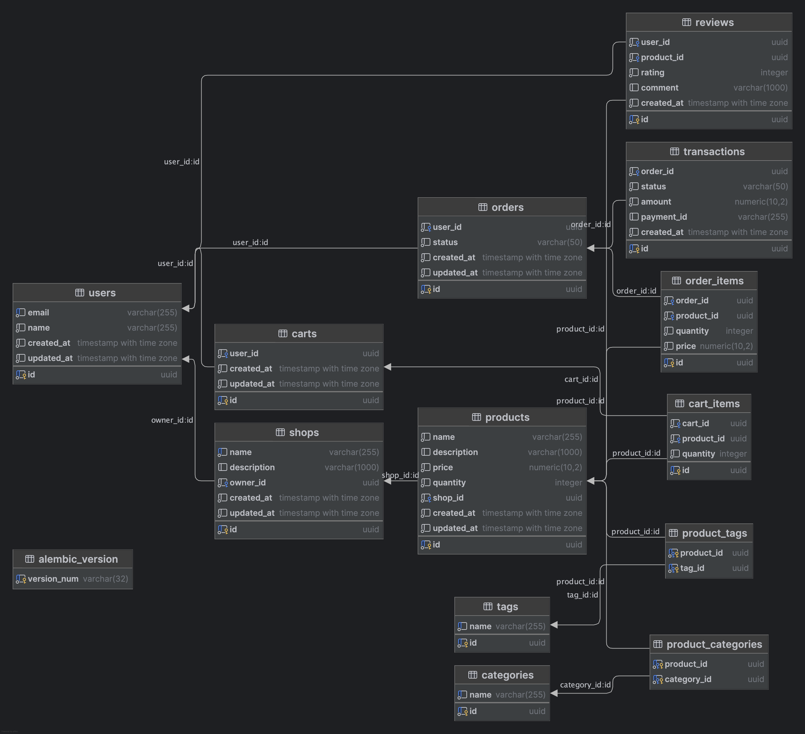

# Oso Demo: Flask

A simple shopping cart application to demonstrate the features of Oso

## Run

system is built as docker system comprised of 3 containers:
1. oso dev server
2. postgres database
3. python flask

```
docker compose up --build
```

## Oso Workshop

1. shopping user should be only allowed to update their own carts


## erd diagram



## Notes
installing pygraphviz on mac, needed for eralchemy2

used to attempt to generate a simple ER diagram, used pycharm tools for documenation
as it was cleaner looking.

```
 pip install \ 
    --use-pep517 \
    --config-settings="--global-option=build_ext" \
    --config-settings="--global-option=-I$(brew --prefix graphviz)/include/" \
    --config-settings="--global-option=-L$(brew --prefix graphviz)/lib/" \
    pygraphviz
```