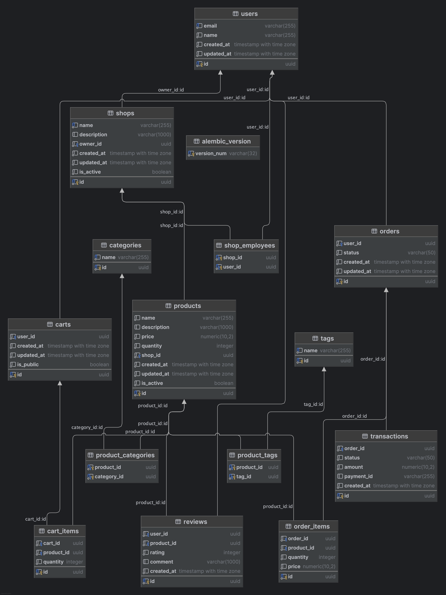

# Oso Demo: Flask

## erd diagram


A simple demonstration of Oso

## Run

```
docker compose up --build
```

## TODO
add a company model:
- what company we are purchasing from


## Notes
```
 pip install \ 
    --use-pep517 \
    --config-settings="--global-option=build_ext" \
    --config-settings="--global-option=-I$(brew --prefix graphviz)/include/" \
    --config-settings="--global-option=-L$(brew --prefix graphviz)/lib/" \
    pygraphviz
```